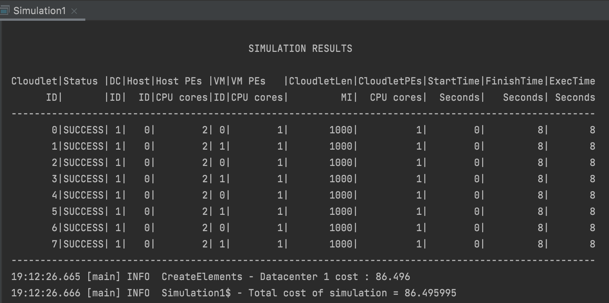
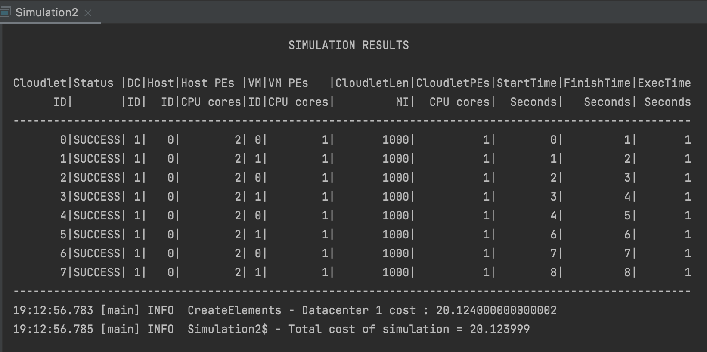
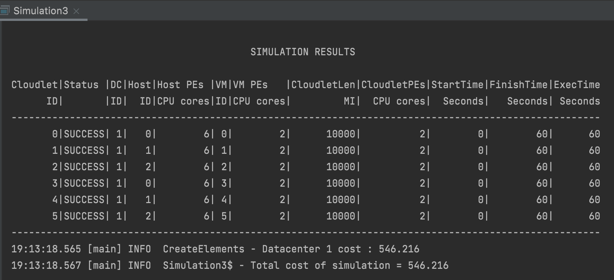
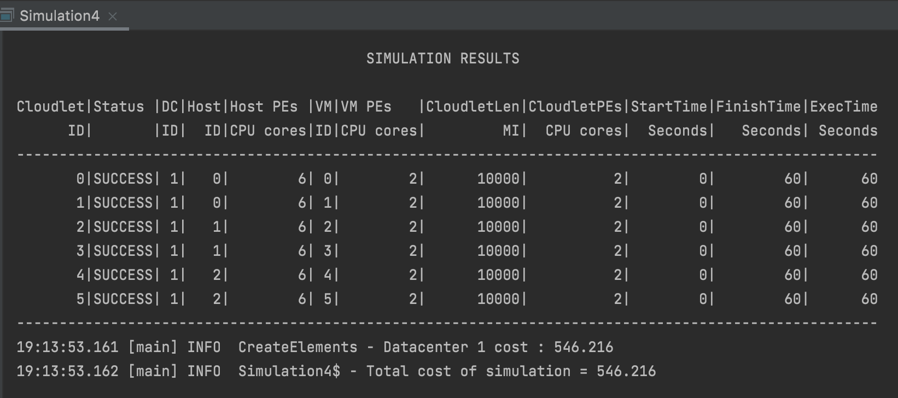
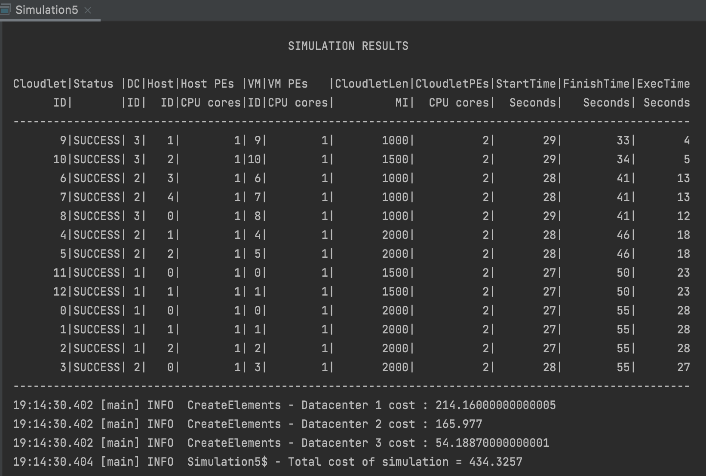

# CS 441 : HW1 by Rishabh Goel
### Create cloud simulators in Scala for evaluating executions of applications in cloud datacenters with different characteristics and deployment models.

In this homework, I have created 5 simulations using cloudsim plus framework. CloudSim Plus is used to enable modeling, simulation, and experimentation of Cloud computing infrastructures and application services.

This framework provides interfaces and classes to implement and simulate hosts, VMs, and cloudlets in a datacenter.

_**DataCenter**_ -> This class represents the infrastructure
provided by the cloud service provider to the users.

_**Host**_ -> A host represents a physical entity in the cloud
environment that has memory, storage and collection of PE
on which the VM’s are going to be created.

_**VM**_ -> It represents a Virtual Machine that runs on a
host in parallel with other VM’s. It executes the Cloudlets
input by the users. 

_**Cloudlet**_ -> It represents the task to be executed.

## <u>Instructions to Execute</u>

### Using IntelliJ
1. Clone the repository from Github
2. Open the project using IntelliJ.
3. Run the individual simulations to see the result.

### Using Command Line
1. Navigate to the folder Rishabh_Goel_hw1
2. Run the simulations with the command : sbt clean compile run
3. Run the test cases using the command : sbt clean compile test

## <u>Files Used</u>

### Helper Utils:
1. `DataCenterInit` -> Used to fetch datacenter details from the .conf file.
2. `HostInit` -> Used to fetch host details from the .conf file.
3. `VMInit` -> Used to fetch vm details from the .conf file.
4. `CloudletInit` -> Used to fetch cloudlet details from the .conf file.
5. `CreateElements` -> Used to initialize the cloud elements and contains functions to create DataCenter, Hosts, VMs, Cloudlets and assign characteristics to them.

### Resources:
1. `application.conf` -> Contains 2 simulator details. **cloudSimulator1** is used by Simulation1 & Simulation2. **cloudSimulator2** is used by Simulation3 & Simulation4.
2. `provider.conf` -> Contains 3 simulator details. cloudSimulatorSAAS for SaaS cloud model. cloudSimulatorPAAS for PaaS cloud model. cloudSimulatorIAAS for IaaS cloud model.
3. `consumer.conf` -> Contains 3 simulator details. cloudSimulatorSAAS for SaaS cloud model. cloudSimulatorPAAS for PaaS cloud model. cloudSimulatorIAAS for IaaS cloud model.
4. `topology.brite` -> This file defines the characteristics of a network to generate accurate synthetic topologies 

## <u>Simulations</u>
### `Simulation1`

This simulation executes **VmAllocationPolicySimple** allocation policy along with **VmSchedulerTimeShared** and **CloudletSchedulerTimeShared** scheduler policies.

In this simulation, we use cloudSimulator1 from application.conf

It consists of a datacenter with 1 Host, 2 VM and 8 cloudlets.

Each cloudlet runs for 8 seconds while sharing VM's CPU time. In Time Shared VM Scheduling, multiple VM's can run in parallel if there are enough PEs to support this. Similarly, in Time Shared Cloudlet Scheduling, multiple cloudlets can run on a single VM if there are sufficient PEs to run them.  

---

### `Simulation2`

This simulation executes **VmAllocationPolicySimple** allocation policy along with **VmSchedulerSpaceShared** and **CloudletSchedulerSpaceShared** scheduler policies.

In this simulation, we use cloudSimulator1 from application.conf

It consists of a datacenter with 1 Host, 2 VM and 8 cloudlets.

Each cloudlet runs for 1 second and the next cloudlet waits for the previous cloudlet to finish its execution. In Space Shared VM Scheduling, all the PEs are allocated to 1 VM and the next VM does not get the resources until the previous VM releases them. In Space Shared Cloudlet Scheduling, only 1 Cloudlet is capable of running in a VM at a point of time. The next cloudlet runs only when the previous cloudlet has been finished.

Comparing the Time Shared and Space Shared policies, we see that even though the total time to complete all the tasks is same but the cost of running the simulation is less (approx 4.3 times) on Space Shared VM and Cloudlet Scheduling simulation.

---

### `Simulation3`

This simulation executes **VmAllocationPolicyRoundRobin** allocation policy along with **VmSchedulerSpaceShared** and **CloudletSchedulerTimeShared** scheduler policies.

In this simulation, we use cloudSimulator2 from application.conf

It consists of a datacenter with 3 Host, 6 VM and 6 cloudlets.

Each cloudlet runs for a total of 60 seconds. In Round Robin VM Allocation policy, the hosts are activated only when the VM is being assigned to them and once the cloudlet finishes its task and the VM is not required anymore, the host goes to deactivated state.

---

### `Simulation4`

This simulation executes **VmAllocationPolicyFirstFit** allocation policy along with **VmSchedulerSpaceShared** and **CloudletSchedulerTimeShared** scheduler policies.

In this simulation, we use cloudSimulator2 from application.conf

It consists of a datacenter with 3 Host, 6 VM and 6 cloudlets.

Each cloudlet runs for a total of 60 seconds. In First Fit VM Allocation policy, the VM is placed in the first host that has suitable resources in it to offer. This policy is efficient in the way that it tries to allocate the max number of possible VMs in the same host to maximize its usage. 

On comparing the result of Simulation 3 and Simulation 4, we observe that both the simulations have the exact same run time as well as cost. The only difference lies in the activation of hosts. In Round Robin, hosts are activated in a cyclic manner whereas in First Fit, the hosts are activated in such a way that the hosts are utilized to their full potential. 

---

### `Simulation5`

-> In **SaaS**, the consumer has control over the number of cloudlets. Other components are fully controlled by the Provider.

-> In **PaaS**, the consumer has complete control over number and characteristics of the cloudlets and number of VMs. Provider manages control over the remaining components.

-> In **IaaS**, the consumer has complete control over VM and cloudlet numbers and their characteristics. Rest of the control is managed by the Provider.

In this simulation, we have created **3 datacenters** (1 for SaaS, 1 for PaaS and 1 for IaaS). The specifications of the 3 datacenters have been designed by keeping the above information in mind.

**provider.conf** contains details which are fixed and decided by the cloud provider. 
**consumer.conf** contains details which are variable and can be edited by the consumer.

 
### Possible Enhancements:
1. Modify the broker class to assign specific number of VMs to hosts in every datacenter
2. consumer.conf can be made to be input at runtime instead of using it as a file
3. Modify config files in such a way that multiple VMs/cloudlets/hosts can have different characteristics

---

## <u>Tests</u>

### Files Used
1. CloudTest -> Contains basic code to check 5 unit tests.

### Tests
1. Test 1 -> Check if the simulation is in running state or not.
2. Test 2 -> Check if the datacenter has been created with hosts and the size of datacenter created is equal to the number of hosts provided in the config file.
3. Test 3 -> Check if the broker has been created or not.
4. Test 4 -> Check if the number of VMs created is same as mentioned in the config file.
5. Test 5 -> Check if the number of Cloudlets created is same as mentioned in the config file.

